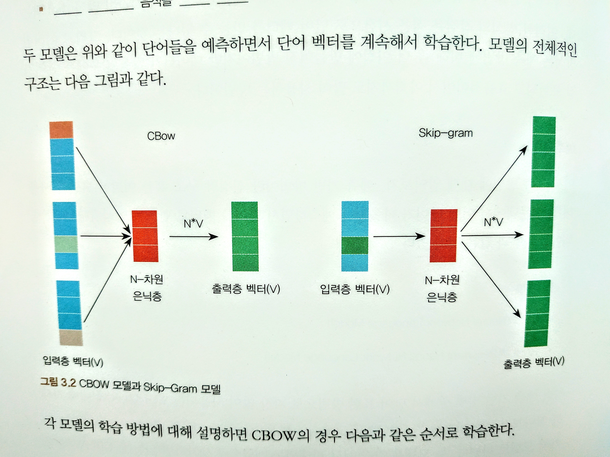
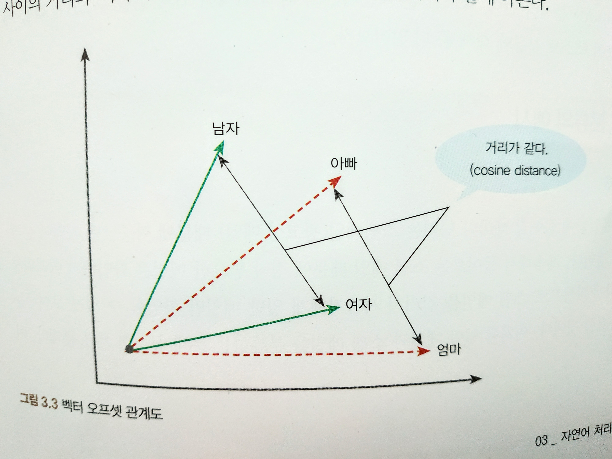
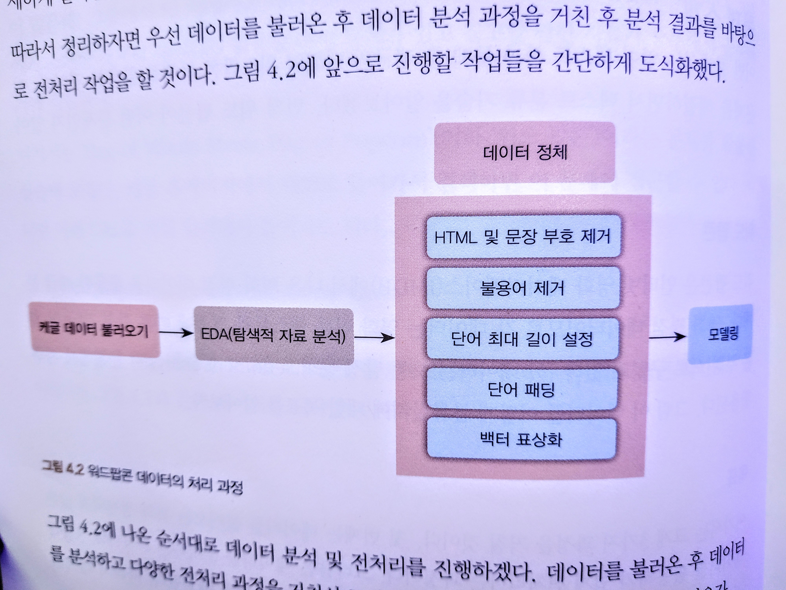
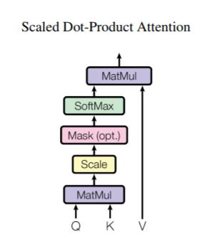
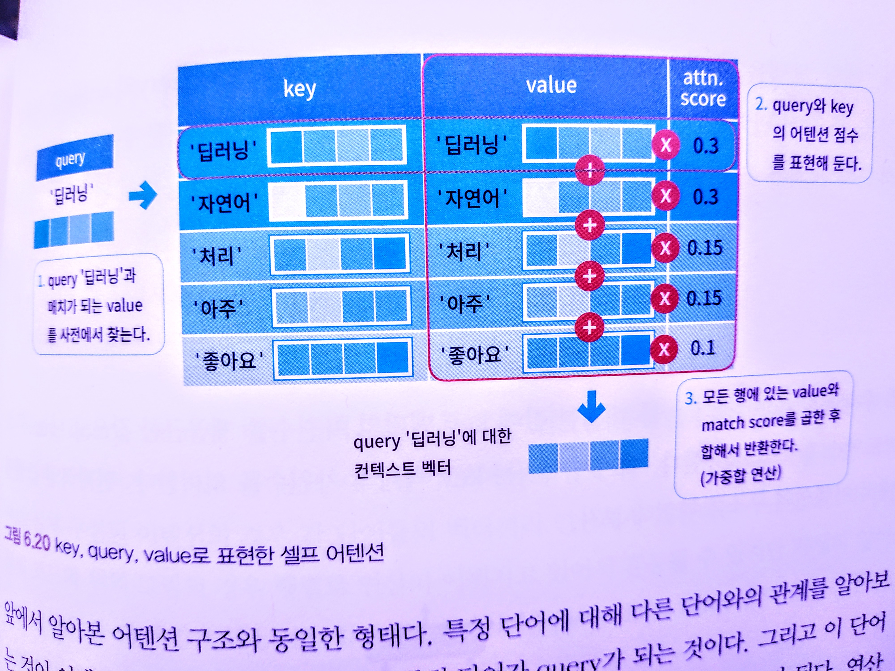
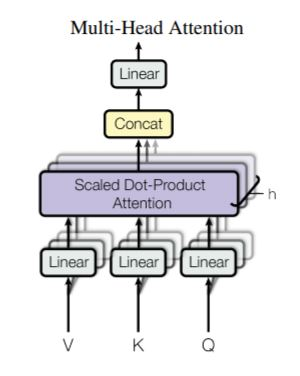
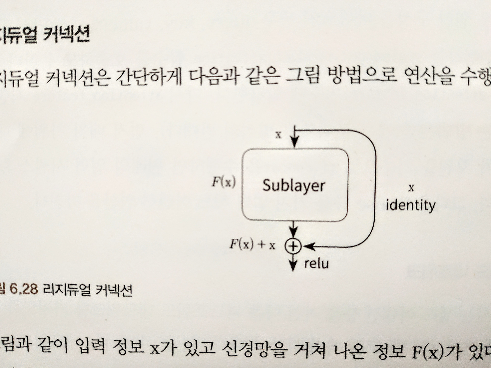

# NLP w/ TF, ML

- author : 전창욱, 최태균, 조중현
- from logit reg to transformer chat bot

## ch-1 intro

## ch-2 NLP dev env

### ss-2-2 scikit-learn

#### sss-2-2-4 scikit-learn을 이용한 특징 추출

- CountVectorizer
  - count base
  - 큰 의미가 없지만 자주 사용되는 단어들(조사, 지시대명사)이 높은 특징 값을 가지므로 왜곡될 수 있다.
- TfidVectorizer
  - TF-IDF, term frequeny - inverse document frequency
    - TF : 특정 단어가 하나의 데이터 안에서 등장하는 횟수
    - DF : 특정 단어가 여러 데이터에 자주 등장하는지 알려주는 지표
    - IDF : DF의 역수, 특정 단어가 다른 데이터에 등장하지 않을수록 커진다.
    - TF \* IDF 두 값을 곱해서 사용 : 특정 단어가 해당 문서에 자주 등장하지만, 다른 문서에는 없는 단어일수록 높은 값
  - 조사, 지시대명사들을 IDF 값이 작아지므로 문제점이 어느 정도 해소된다.
  - 단순 횟수보다 각 단어의 특성을 좀 더 잘 반영할 수 있다.
- HashingVectorizer
  - count 방식이지만, 해싱을 이용해 속도가 빠르다.

### ss-2-3 자연어 토크나이징 도구

#### sss-2-3-1 영어 토크나이징 라이브러리

- NLTK
  - 50개 이상의 영어 말뭉치 리소스를 활용해 영어 텍스트를 분석할 수 있게 제공
- Spacy
  - 상업용
  - 8개 국어 이상 지원
  - 딥러닝 언어 모델 개발도 지원

#### sss-2-3-2 한글 토크나이징 라이브러리

- KoNLPy
  - 타 형태소 분석기 사용 가능
  - 토크나이징 + 구문 분석까지 가능

## ch-3 NLP intro

### ss-3-1 word representation

- 어떻게 자연어를 컴퓨터에게 인식시킬 수 있을까
- 유니코드, 아스키 코드 : 언어적 특성이 없다.
- word representation : 언어적 특성을 반영해 단어를 수치화
- (same as) word embedding, word vector
- Glove : count base + predict base
- 상황에 맞게 단어 표현방법을 선택해야 한다.

#### sss-3-1-1 one-hot encoding

- problem : sparse
- sol : distributed hypothesis based : count base, predictive base

#### sss-3-1-2 count base

- count based method : 어떤 글의 문맥 안에 단어가 동시에 등장하는 횟수를 세는 방법
- co-occurrence, 동시출현, 공기
- 하는 법
  1. 동시 등장 횟수를 하나의 행렬로 나타낸다.
  2. 그 행렬을 수치화해서 단어 벡터로 만든다.
- 벡터화 방법
  - 특이값 분해, SVD, singular value decomposition
  - 잠재의미분석, LSA, latent semantic analysis
  - HAL, hyperspace analogue to language
  - Hellinger PCA(principal component analysis)
- 장점
  - 시간 복잡도가 낮다
  - 데이터가 많을 경우 예측 방법에 비해 성능이 좋다.

#### sss-3-1-3 predictive base

- predictiva based method : 모델을 이용해 특정 문맥에서 어떤 단어가 나올지를 예측하면서 단어를 벡터로 만드는 방식
- 종류
  - word 2 vec : CBOW, skip-gram
  - NN LM(language model)
  - RNN LM
- CBOW와 skip-gram

- CBOW 학습순서
  1. 입력층 벡터 : 각 주변 단어들을 원-핫 벡터로 만들어 입력값으로 사용
  2. n-d hidden layer : 가중치 행렬을 각 원-핫 벡터에 곱해서 n-d vector를 만든다.
  3. 출력층 벡터 : 만들어진 n-d vector를 모두 더한 후, 갯수로 나눠, 평균 n-d vector를 만든다.
  4. n-d vector에 다시 가중치 행렬을 곱해서 원-핫 벡터와 같은 차원의 벡터로 만든다.
  5. 만들어진 벡터를 실제 예측하려고 하는 단어의 원-핫 벡터와 비교해서 학습한다.

- skip-gram 학습순서
  1. 입력층 : 하나의 단어를 원-핫 벡터로 만들어서 입력값으로 사용
  2. 은닉층 : 가중치 행렬을 원-핫 벡터에 곱해서 nd 벡터를 만든다.
  3. 출력층 : nd 벡터에 다시 가중치 행렬을 곱해서 원-핫 벡터와 같은 차원의 벡터로 만든다.
  4. 만들어진 벡터를 실제 예측하려는 주변 단어들 각각의 원-핫 벡터와 비교해서 학습한다.

- word 2 vec의 장점
  - count base보다 단어 간의 유사도를 잘 측정한다.
  - 단어의 복잡한 특징까지 잡아낸다.
  - 단어 벡터 간의 유의미한 관계를 측정할 수 있다 : cosine distance를 통해
  

- 보통 cbow < skip-gram

### ss-3-2 텍스트 분류

- 스팸 분류 : 이진 분류
- 감정 분류 : 이진분류, 다중분류 => [text classification](#ch-4-text-classification)
- 뉴스 기사 분류
- 품사 분류

- 지도학습 대표적인 모델
  - 나이브 베이즈 분류
  - SVM
  - NN
  - 선형 분류
  - logit
  - RF

- 비지도학습 대표적인 모델
  - k-meansclustering
  - hierarchical clustering

### ss-3-3 텍스트 유사도

- 유사도를 측정하는 방법
  - 같은 단어의 갯수
  - 형태소로 나누어 형태소를 비교
  - 자소 단위로 나누어 단어를 비교
- NN기반 : 텍스트를 벡터화한 후, 벡터화된 각 문장 간의 유사도를 측정

- Jaccard Similarity : 교집합/합집합
  1. 두 문장을 각각 단어의 집합으로 만든다.
  2. 두 집합의 교집합의 갯수를 두 집합의 합집합으로 나눈다.

- cosine similarity
  - -1 ~ 1 : 1일수록 유사하다
    - 관련이 없으면 직교한다 : 0
    - 그러면 -1이면 완전 negative하게 관련있는 건가???
  - 일반적으로 성능이 좋다.
  - 단순히 거리를 구하는 게 아니라, 벡터의 각도를 구하는 것이기 때문.
  - $`\cos\theta = \frac{\vec{a}\cdot\vec{b}}{||\vec{a}||||\vec{b}||}`$
  - <pre><code>from sklearn.metrics.pairwise import cosine_similarity
  cosing_similarity(sent1, sent2)</code></pre>

- Euclidean Distance, L2-distance
  - <code>sklearn.metrics.pairwise.euclidean_distances(sent1, sent2)</code>
  - $`d(x,y) = \sqrt{(x_1-y_1)^2+(x_2-y_2)^2+...+(x_n-y_n)^2}`$
  - 그냥 쓰면 진짜 거리를 재기 때문에 척도로 사용하기 어렵다
  - 벡터를 normalize한 뒤, 거리를 재면 0~1사이로 정규화할 수 있다.

- Manhattan similarity, L1-distance
  - $`MaDist = \sum_{i=1}^{n}|a_i-b_i|`$
  - euclidean과 마찬가지로 척도로 사용하기 위해서는 normalizing을 하는 게 좋다.

### ss-3-4 [자연어 생성](#ch-6-chat-bot)

### ss-3-5 기계 이해

- NLP 전반의 개념을 모두 사용한다.
- 메모리 네트워크

### ss-3-6 데이터 이해하기

- EDA
- 기술통계량
- viz
- 분석가의 선입견을 배제하고 데이터가 보여주는 수치만으로 분석을 진행
- NLP에서 EDA
  - 문장의 길이 : 단어의 수, 알파벳 수
  - 워드 클라우드
  - label 비율

## ch-4 text classification

### ss-4-1 EDA and preparing

- EDA
  - 데이터 크기
  - 데이터 개수
  - 각 리뷰의 문자 길이 분포
  - 많이 사용된 단어
  - 긍정, 부정 데이터의 분포

- preparing
  - html tage, 특수문자 제거
  - 불용어 제거
  - 대/소문자 맞춤
  - 텍스트 => 인덱스 벡터
  - 각 데이터의 길이를 맞춰준다 : 길면 자르고, 짧으면 0으로 패딩

### ss-4-2 modeling

- vectorization
  - TF-IDF vectorization
  - word 2 vec
- train
- predict
- 분류문제라서 그런지 그냥 분류하는 모델을 쓴다. 텍스트 자체에 라벨링

## ch-5 text similarity

- Quara에서 중복 질문찾기

### ss-5-3 modeling

- XGB
- CNN
- MaLSTM

## ch-6 chat bot

- rule base, similarity base w/ ml, hybrid, scenario base

### ss-6-3 seq 2 seq modeling

- 여기서 chat-bot을 구현한다.

### ss-6-4 transformer network

- 기존의 seq 2 seq의 encoder-decoder 수조를 가지고 있지만,
CNN, RNN 등을 사용하는 게 아니라 attention 구조로만 전체 모델을 만들어 attention 기법의 중요성을 강조
- [Attention is all you need, 2017 google at al](../../assets/attention-is-all-you-need.pdf) : 이건 조만간 꼭 읽어봐야지

- [transformer 구현](../../modules/transformer.py)

#### sss-6-4-1 self attention

- 문장에서 각 단어끼리 얼마나 관계가 있는지 계산해서 반영
- 학습 순서
  1. 각 단어가 단어벡터로 이루어져 있다
  2. 각 단어의 어텐션 스코어를 구한다.
    - 내적 등 유사도 계산 방법으로 구하는 방법, NN으로 구하는 방법
  
  3. 2번에서 구한 어텐션 맵에 소프트 맥스 함수를 적용하여 어텐션 스코어를 확률값으로 표현한다.
    - 특정 단어에 대한 다른 단어와의 연관도 값이 확률로 표현된다.
  4. 어텐션 스코어와 각 단어벡터와 상수곱 연산을 통해 가중합 한다.
  5. 해당 단어에 대한 벡터값으로 사용한다.
  
- 다른 단어들과의 유사도를 '어텐션'해서 새로운 단어 벡터를 구할 수 있다.

#### sss-6-4-2 모델 구현

##### atc-6-4-2-1 multi head attention

- multi head attention : dot product attention 구조가 중첩된 형태
- scale dot product
  - 입력 : query, key, value
    - query : 찾고자 하는 단어
    - key : 사전에 등록된 단어
    - value : key에 해당하는 의미
  - 
  - 
  - 과정
    1. Q, K에 대한 어텐션 스코어 맵을 만든다,
    2. 스케일 조정을 한다.
    3. 선택적으로 마스크를 적용한다.
    4. 소프트맥스 함수를 적용한다.
    5. 마지막으로 value에 대해 가중합을 구한다.
  - self attention은 query 행렬과 key행렬이 전치관계
- 순방향 어텐션 마스크
  - 디코더 파트에서 자신보다 뒤에 있는 단어를 참고하지 않게 하는 기법
- multi-head attention
  - 
  - 어텐션 맵을 여럿 만들어 다양한 특징에 대한 어텐션을 볼 수 있게 한 방법

##### atc-6-4-2-2 position wise feedforword network

- $`FFN(x) = max(0,xW_1,b_1)W_2+b_2`$
- self-attention layer 이후에 feedforward network
- 각 시퀀스의 한 토큰 벡터 각각에 대해 연산을 수행

##### atc-6-4-2-3 residual connection

- 'Add & Norm'
- sublayer는 F(x) 정보이고, input이 x정보이다.
- 매층을 거치면서 F(X)가 드롭아웃 + layer normalization한다.
  - overfit 방지를 위해 두가지 정규화 기법 도입

##### atc-6-4-2-4 encoder

##### atc-6-4-2-5 decoder

##### atc-6-4-2-6 position encoding

- 해당 논문에서는 다음을 입력값에 추가로 넣는 방식으로 해결
  - $`PE_{(pos,2i)} = \sin(pos/10000^{2i/d_{model}})`$ : index가 짝수인 경우, 사인함수 값 할당
  - $`PE_{(pos, 2i+1)} = \cos(pos/10000^{2i/d_{model}})`$ : 홀수인 경우, 코사인 함수값 할당
