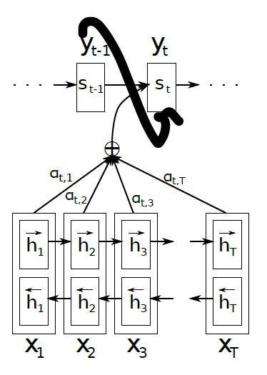

### fast text

- 원리는 word2vec
- n-gram으로 word를 잘라서, 각각의 벡터 값을 합해 계산
- 결론적으로 오타등에 강하다 : why? 오타가 있어도 벡터합은 비슷해지기 때문

### character embedding

- 기존 w2v vector와 character embedding으로 학습한 vector를 concat해서 사용하는 방법이 있다.

### attention

- 관련 논문 : [NEURAL MACHINE TRANSLATION BY JOINTLY LEARNING TO ALIGN AND TRANSLATE](../3w/attention-article.pdf)
- 문제제기 : seq 2 seq
  - MT 모델에서 input seq에서 output seq로 정보가 전달되는데 '시간 순서'가 중요하다.
- idea 1 : 어차피 NLP는 ts 데이터가 아니잖아?
- solution : 시간 순서대로 데이터를 처리하는 게 아니라, 하나의 데이터를 처리할 때, 전체를 보자
- 모델 구현
  - encoder는 bi-directional하게 똑같이 구현
  - 각 값을 예측할 때, attention weight를 학습시켜서, a.w에 따라 어떤 node를 집중해서 볼지 결정
    - attention weight를 어떻게 학습시키는지는 좀 어렵당
  - 그 다음에 다시 rnn

### bert

- [bert 톺아보기]()
- input
  - segment embedding + position embedding + token embedding
- encoder
  - multi head attention : 12개가 있어서, input vector를 나눠서 집어넣는다.
    - scaled dot-product attention
- 학습
  - bidirectional하다
- 응용
  - api를 보면 중간 레이어에서 뽑아올 수도 있다.
  - 자세한 건 블로그에서 태스크별로 뭐가 좋았는지 실험결과가 있다.
